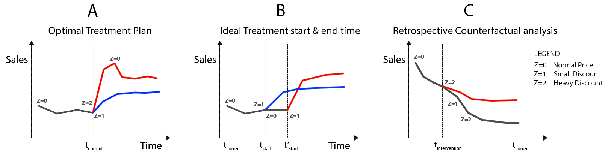
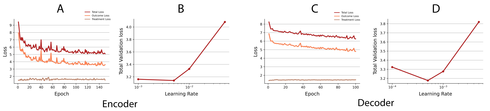

# Causal Counterfactual Forecasting - ACIC 2023
This is my final project for the **Causal Inference** course (APSTA-GE 2012) taught by Prof. Jennifer Hill at NYU. I am participating in the annual [American Causal Inference Conference (ACIC) 2023](https://sci-info.org/annual-meeting/) data challenge.

Detailed findings and analysis: [Report](Report.pdf)

<font size="1"> 🌟 the repo if you find it interesting!</font>

## Project Introduction

Supervised Machine Learning methods are typically used for time series forecasting but do not account for counterfactual outcomes and time-dependent confounders. These models only fit observed data. 

Observational Causal Inference methods, on the other hand, are typically used for estimating treatment effect estimands, and do not focus on forecasting future potential outcomes. 

The problem statement is to predict future counterfactuals for 5 time steps under 6 different treatment assignments for every unit.



**Applications of counterfactual estimation in an e-commerce setting.** The plots show the effect of pricing (treatment) on sales (outcome) of a product over time. 

<br>

## Main Contributions
1. **Evaluation of a counterfactual forecasting model (CRN) outside the healthcare setting.** Most recent methods, including the CRN, have been evaluated on a simulated tumor growth dataset or data in the healthcare domain. In this work, I evaluated the model on the ACIC challenge dataset, which mirrors data in an e-commerce business setting.

2. **General purpose implementation of CRN to work with any time-series dataset.**  The open-source implementation of CRN only works with the simulated tumor dataset. Here I provide a modified script and data processing notebook to repurpose your data to work with CRN.

3. **Discussion of the plausibility of causal assumptions.** While all studies on counterfactual forecasting list the necessary assumptions for causal claims, the plausibility of these assumptions in real-world settings are not discussed. In this work, I discuss these assumptions in the context of the e-commerce example and argue that they are difficult to satisfy in practice.
## Data
The data is simulated. However, drawing analogy to an e-commerce problem:

We have the sales (outcome) of ~4000 products for 95 weeks under one or more of 6 different pricing strategies (treatment levels). There are three binary and three numeric covariates, some of which are static product level features (example- Average sale, Product category), while others are temporal features (example- Inventory count).

The goal is to predict the sales of each item for the next 5 weeks under each pricing strategy (intervention).

## Estimand
The estimand is the expected value of the potential outcome at time t+𝜏 under a sequence of treatments from time t to t+𝜏-1, given the observed data till the current time step t. The loss is measured using the RMSE error over all forecast time steps and counterfactual states for each unit.

```math 
    Estimand = E[Y_{t+\tau}[Z(t, t+\tau-1)] | H_t]
```
```math 
    RMSE = \sqrt{\frac{\sum_{i, k, w}(y_{i,k}(w) - \hat{y}_{i,k}(w))^2}{N * N_K * N_W }}
```


Where $N$ is the number of units, $N_K$ the number of time steps, $N_W$ the number of treatments, $i$ a unit, $k$ a time step, $w$ a treatment, $y$ the
ground truth outcome and $\hat{y}$ the predicted outcome.

## Causal Assumptions
(Details in Report)
1. Sequential Ignorability
2. Overlap / Positivity
3. SUTVA

## Results

|         Model          | RMSE on log-transformed output | RMSE on raw output |
|:----------------------:|:------------------------------:|:------------------:|
|           CRN          |              3.08              |       116.24       |
| Persistence (Baseline) |            **0.73**            |      **2.10**      |

The CRN model underperforms the baseline model. The bias is further amplified when the log-transformed predictions are exponentiated back to the original scale. Note that scaling the output is important to avoid the outcome and treatment losses being at very different scales. Trying different scaling techniques on the outcome variable can be explored as a next step. 

## Next Steps
* Error analysis
* Improve the model predictions by experimenting with different transformations on the outcome variable, and hyperparameter tuning. 
* Benchmark the model against standard supervised learning approaches such as ARIMA, and LSTMs, as well as causal models such as R-MSNs, and Causal Transformers. 
* Qualitative analysis of the balancing representations by plotting 2D t-SNE plots.
* Obtain uncertainty estimates of the outcome predictions.