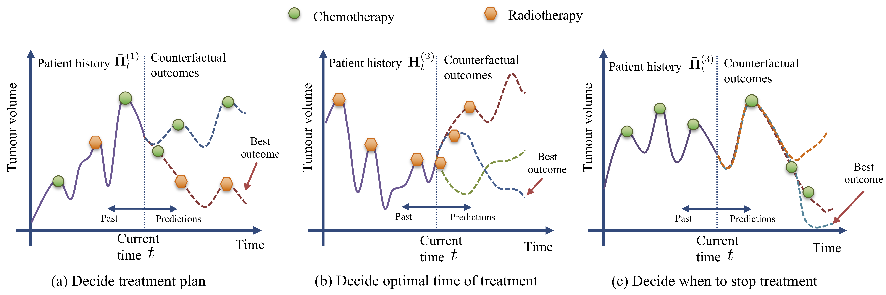
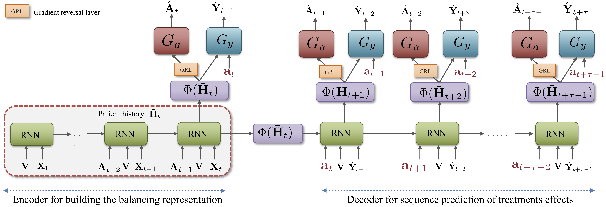

# CRN for ACIC
Code adopted from https://github.com/ioanabica/Counterfactual-Recurrent-Network

## Steps to replicate (ACIC analysis by Sargun):
1. Create a conda env with Python version 3.6: ```conda create -p "./crn_env" python==3.6```
2. Install required packages: ```pip install requirements.txt```
3. If you want to train the model on a GPU, you need to install the old version of CUDA config file compatible with Tensorflow 1 (cudart64_100.dll). The file can be found [here](https://www.joe0.com/wp-content/uploads/2019/10/cudart64_100.dll_.zip). Place the file in the NVIDIA GPU Computing Toolkit's CUDA bin folder.


# [Estimating counterfactual treatment outcomes over time through adversarially balanced representations](https://openreview.net/forum?id=BJg866NFvB)

### Ioana Bica, Ahmed M. Alaa, James Jordon, Mihaela van der Schaar

#### International Conference on Learning Representations (ICLR) 2020

Code Author: Ioana Bica (ioana.bica95@gmail.com)

## Introduction
The Counterfactual Recurrent Network (CRN) is a causal inference method for estimating the effects of treatments assigned 
over time from observational data. CRN constructs treatment invariant representations at each timestep in order to break the 
association between patient history and treatment assignments and thus removes the bias from time-dependent confounders 
present in observational datasets. By performing counterfactual estimation of future treatment outcomes, CRN can be 
used to answer critical medical questions such as deciding when to give treatments to patients, when to start and 
stop treatment regimes, and also how to select from multiple treatments over time. We illustrate in 
the following figure the applicability of our method in choosing optimal cancer treatments.


## Model architecture
CRN consists of an encoder network which builds treatment invariant representations of the patient history that are used to 
initialize the decoder. The decoder network estimates outcomes under an intended sequence of future treatments, 
while also updating the balanced representation. The model architecture is illustrated in the following figure:



## Dependencies

The model was implemented in Python 3.6. The following packages are needed for running the model:
- numpy==1.18.2
- pandas==1.0.4
- scipy==1.1.0
- scikit-learn==0.22.2
- tensorflow-gpu==1.15.0

## Running and evaluating the model:

Since in real datasets counterfactual outcomes and the degree of time-dependent confounding are not known, we evaluate 
the CRN on a Pharmacokinetic-Pharmacodynamic model of tumour growth, which uses a state-of-the-art bio-mathematical model to 
simulate the combined effects of chemotherapy and radiotherapy in non-small cell lung cancer patients ([Geng et al., Nature Scientific Reports 2017](https://www.nature.com/articles/s41598-017-13646-z)). The same simulation 
model was used by [Lim et al., NeurIPS 2018](https://papers.nips.cc/paper/7977-forecasting-treatment-responses-over-time-using-recurrent-marginal-structural-networks.pdf).
We adopt their implementation from: https://github.com/sjblim/rmsn_nips_2018 and extend it to incorporate counterfactual outcomes.

The chemo_coeff and radio_coeff in the simulation specify the amount of time-dependent confounding
applied to the chemotherapy and radiotherapy treatment assignments in the generated observational dataset. The results in the paper were obtained by varying the
chemo_coeff and radio_coeff, and thus obtaining observational datasets with different amounts of time-dependent confounding. 

Figure 4 in our paper illustrates the results for gamma = chemo_coeff = radio_coeff in {1, 2, 3, 4, 5} for both one-step-ahead 
prediction and sequence prediction (five-step-ahead prediction) of counterfactual outcomes.

To train and evaluate the Counterfactual Recurrent Network on observational datasets for tumour growth, run the following command with the chosen command line arguments. 

```bash
python test_crn.py
```
```
Options :
        --chemo_coeff	                     # Parameter controlling the amount of time-dependent confounding applied to the chemotherapy treatment assignment. 
	--radio_coeff	                     # Parameter controlling the amount of time-dependent confounding applied to the radiotherapy treatment assignment.
	--results_dir                        # Directory for saving the results.
	--model_name                         # Model name (used for saving the model).
	--b_encoder_hyperparm_tuning         # Boolean flag for performing hyperparameter tuning for the encoder. 
	--b_decoder_hyperparm_tuning         # Boolean flag for performing hyperparameter tuning for the decoder. 
```

Outputs:
   - root mean squared error (RMSE) for one-step-ahead prediction of counterfactual outcomes.  
   - RMSE for five-step-ahead prediction of counterfactual outcomes. 
   - Trained encoder and decoder models. 

The synthetic dataset for each setting of chemo_coeff and radio_coeff is over 1GB in size, which is why it is re-generated every time the code is run. 

### Example usages

To test the Counterfactual Recurrent Network, run (this will use a default settings of hyperparameters):
```
python test_crn.py --chemo_coeff=2 --radio_coeff=2 --model_name=crn_test_2
```

To perform hyperparameter optimization and test the Counterfactual Recurrent Network, run:
```
python test_crn.py --chemo_coeff=2 --radio_coeff=2 --model_name=crn_test_2 --b_encoder_hyperparm_tuning=True --b_decoder_hyperparm_tuning=True
```

For the results in the paper, hyperparameter optimization was run (this can take about 8 hours on an
NVIDIA Tesla K80 GPU). 

 
### Reference

If you use this code, please cite:

```
@article{bica2020crn,
  title={Estimating counterfactual treatment outcomes over time through adversarially balanced representations},
  author={Bica, Ioana and Alaa, Ahmed M and Jordon, James and van der Schaar, Mihaela},
  journal={International Conference on Learning Representations},
  year={2020}
}
```
